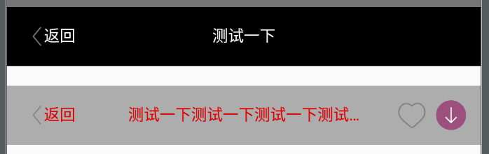

# BaseTitleLayout


[](https://jitpack.io/#huiger/BaseTitleLayout)

## 效果图


## Gradle Dependency
```
allprojects {
    repositories {
        ...
        maven { url "https://jitpack.io" }
    }
}

dependencies {
     compile 'com.github.huiger:BaseTitleLayout:v1.0.1'
}
```

## xml使用
```
<com.huige.library.BaseTitleLayout
        android:layout_width="match_parent"
        android:layout_height="wrap_content"
        app:titleRightImg1="@mipmap/image1"
        android:background="#ADADAD"
        app:titleTextColor="#e20000"
        app:titleRightImg2="@mipmap/image2"
        app:titleCenterText="测试一下测试一下测试一下测试一下测试一下"/>
```

## 监听
```
titleLayout.setOnTitleClickListener(new TitleLayoutClickListener() {
            @Override
            public void onLeftClickListener() {
                super.onLeftClickListener();
                Log.d("msg", "MainActivity -> onLeftClickListener: ");
            }

            @Override
            public void onRightTextClickListener() {
                super.onRightTextClickListener();
                Log.d("msg", "MainActivity -> onRightTextClickListener: ");
            }

            @Override
            public void onRightImg1ClickListener() {
                super.onRightImg1ClickListener();
                Log.d("msg", "MainActivity -> onRightImg1ClickListener: ");
            }

            @Override
            public void onRightImg2ClickListener() {
                super.onRightImg2ClickListener();
                Log.d("msg", "MainActivity -> onRightImg2ClickListener: ");
            }
        });
```

## 其它属性
|      name        | format    |
| ---------------- | :--:      |
| titleTextColor   | color     |
| titleTextSize    | dimension |
| titleLeftImg     | reference |
| titleLeftText1   | string    |
| titleCenterText  | string    |
| titleRightImg1   | reference |
| titleRightImg2   | reference |
| titleRightText   | string    |

